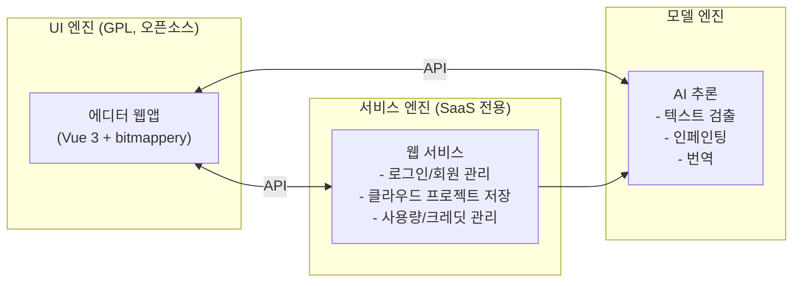
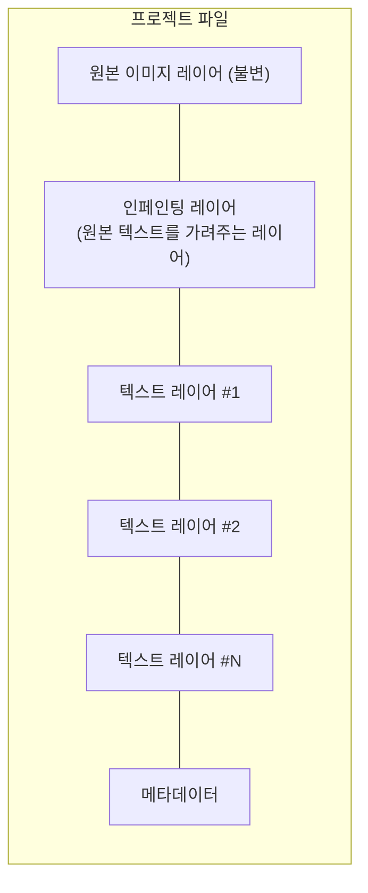
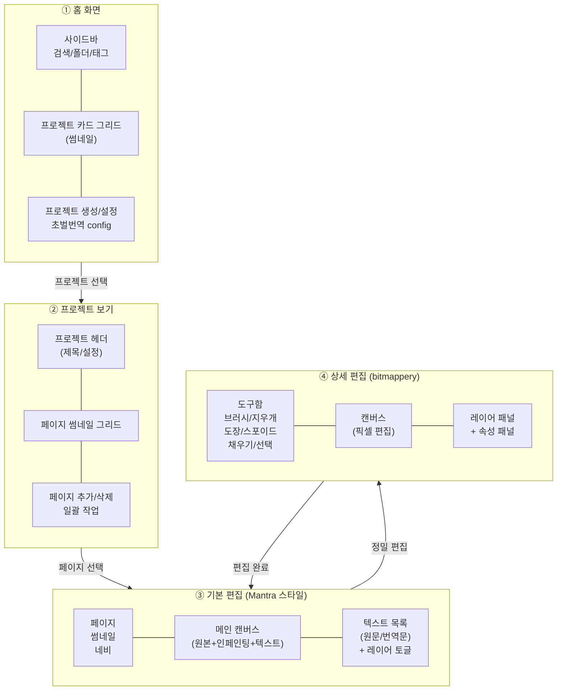

# TOWA — Translator's One-stop Workstation with AI

## 1. 프로젝트 개요

만화/웹툰 번역 작업을 **외부 프로그램 없이 하나의 앱에서 완결**하는 AI 통합 워크스테이션.

기존 도구들의 한계:
- **그래픽 편집 툴** (Photoshop 등): 높은 수준의 편집이 가능하지만 AI 연동이 없어 모든 작업이 수동
- **AI 번역 도구** (Torii, BallonsTranslator 등): 자동 번역은 빠르지만 편집 기능이 미흡하여 결국 외부 툴로 후처리 필요

TOWA는 이 간극을 메운다: **AI가 초벌 번역과 배경 복원을 자동 수행하고, 내장된 편집 도구로 미흡한 부분을 즉시 보정**한다.

### 핵심 가치
> AI가 초안을 잡고, 사람이 미흡한 부분을 즉시 수정하여 최종 결과물을 도출하는 전문가 전용 최적화 인터페이스

### 타겟 사용자
고퀄리티 만화 번역을 추구하는 모든 번역가 (프로/취미 무관)

### 지원 언어
- 1차: 일본어 → 한국어
- 2차: 영어 → 한국어
- 추후 확장 가능

엔진 간 HTTP 규약: [INTER_ENGINE_HTTP.md](/home/user/dev/TOWA/INTER_ENGINE_HTTP.md)

---

## 2. 시스템 아키텍처

### 2.1 3개 엔진 구조

TOWA는 3개의 독립 프로그램으로 구성된다:

| 엔진 | 역할 | 기술 |
|------|------|------|
| **UI 엔진** | 에디터 UI + 간단한 로직 | Vue 3, bitmappery 포크 |
| **모델 엔진** | AI 추론 (번역, 인페인팅 등) | FastAPI, PyTorch |
| **서비스 엔진** | 클라우드 프로젝트 저장, 로그인, 사용량 관리 | FastAPI, SQLAlchemy |

### 2.2 배포 모델

**1차 구현 — 2가지 경로:**

- **경로 A (SaaS)**: 서버에서 3개 엔진을 모두 돌림 → 사용자는 **웹 브라우저로 접속**
- **경로 B (로컬)**: UI 엔진 + 모델 엔진을 다운받아 로컬에서 돌림 (서비스 엔진 없음)
  - 사용자의 개인 API 키 연결 가능 (OpenAI, Anthropic 등)
  - API 없이 로컬 모델도 사용 가능

**2차 구현 (추후):**

- UI 엔진을 Electron으로 래핑 → 데스크톱 앱처럼 동작하면서 SaaS 백엔드 연결

UI 엔진 입장에서는 모델 엔진/서비스 엔진의 주소만 설정으로 바꾸면 되는 구조.

### 2.3 UI 엔진 구조 (`ui_engine/`)

- **기반**: bitmappery (Vue 3 기반 오픈소스 이미지 에디터) 포크
- **1차 배포**: 웹앱 (브라우저 접속)
- **2차 배포**: Electron 데스크톱 앱 (추후)
- **라이선스**: GPL (오픈소스)

bitmappery를 "상세 편집 뷰"의 캔버스 엔진으로 사용하고, 나머지 화면(프로젝트 관리, 번역 작업 뷰 등)은 새로 구현한다. AI 호출이 필요 없는 간단한 기능(로컬 파일 관리, UI 로직 등)은 UI 엔진 내에서 직접 처리한다.

---

## 3. AI 파이프라인

### 3.1 처리 단계

1. **텍스트 검출**: Text Region 검출 + bounding box 생성 (DBNet++ / CRAFT)
2. **픽셀 마스크 생성**: bounding box 내 픽셀 레벨 segmentation
3. **OCR / 번역**: 원문 인식 → LLM 기반 번역
4. **인페인팅 레이어 생성**: 원본 이미지의 텍스트 부분을 배경으로 복원하는 레이어
5. **텍스트 레이어 생성**: 번역된 텍스트를 편집 가능한 형태로 배치
6. **레이어 분리 출력**: 편집 가능한 프로젝트 파일로 저장

### 3.2 레이어 구조

- 원본 + 인페인팅 레이어 = 텍스트가 지워진 깨끗한 이미지
- 위에 텍스트 레이어들을 올리면 = 번역된 최종 이미지

---

## 4. UI 흐름

4개의 주요 화면으로 구성:

- **③ → ④ 전환**: 정밀 편집이 필요할 때 진입
- **④ → ③ 복귀**: 편집 결과를 반영하고 돌아감

---

## 5. 장기 로드맵 (참고용)

당장 구현 대상은 아니지만 설계 시 고려해야 할 요소들:

- **커뮤니티 기능**: 번역 프로젝트 공유/선점 시스템
- **워크플로우 플러그인**: ComfyUI처럼 확장 가능한 AI 파이프라인
- **모델 개발 지원**: 로컬 모델 학습/벤치마크 기능
- **Electron 래핑**: UI 엔진을 데스크톱 앱으로 패키징 (2차 구현)
- **PSD/기타 포맷 export**
- **협업 기능**
