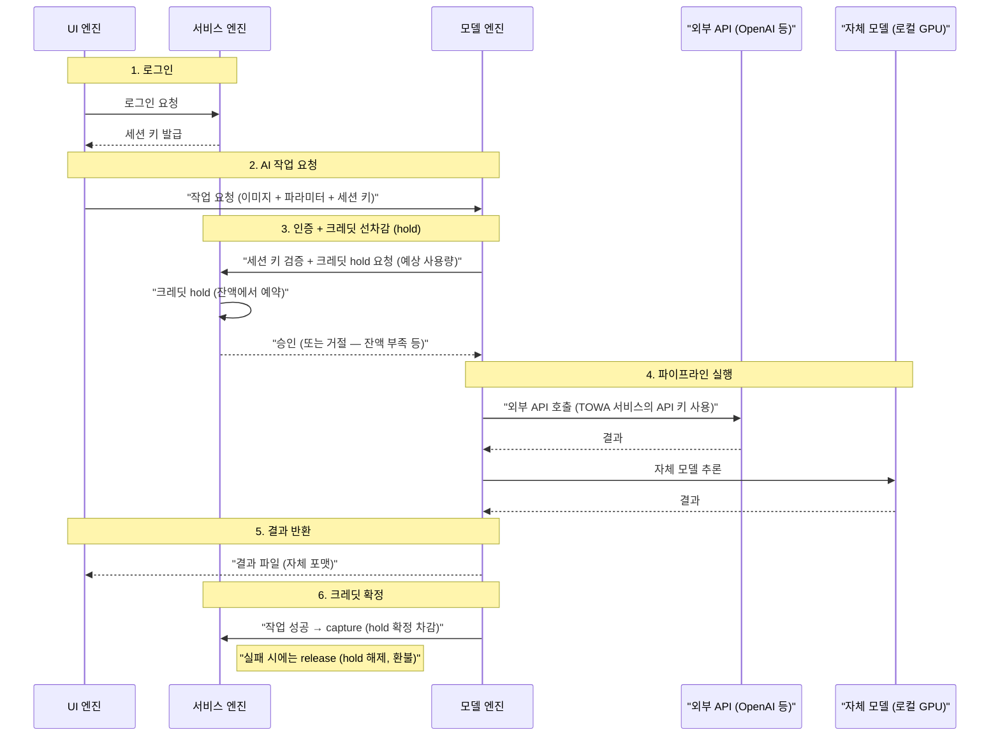
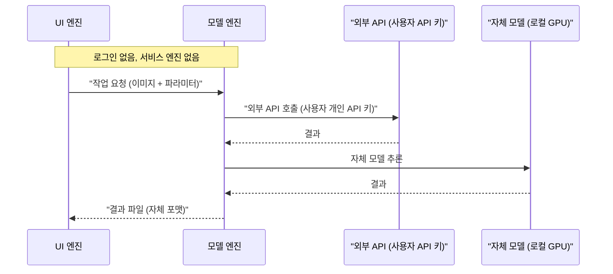

## 개요

3개 엔진(UI / 모델 / 서비스) 간의 통신 흐름을 정리한다.

핵심은 **UI 엔진이 모델 엔진에 직접 작업을 요청하되, 인증/과금은 서비스 엔진이 담당**하는 구조이다.

---

## SaaS 시나리오

### 흐름 요약

1. **UI → 서비스**: 로그인 → 세션 키 획득
2. **UI → 모델**: 이미지 + 파라미터 + 세션 키를 보내서 AI 작업 요청
3. **모델 → 서비스**: 세션 키 검증 + 예상 사용량 기반 크레딧 hold 요청
4. **서비스 → 모델**: 승인(hold 완료) / 거절(잔액 부족 등)
5. **모델**: 승인된 경우, **TOWA 서비스가 보유한 API 키**로 외부 API + 자체 모델 파이프라인 실행
6. **모델 → UI**: 결과 파일 반환
7. **모델 → 서비스**: 성공 시 capture(확정 차감), 실패 시 release(hold 해제)

### 핵심 포인트

- **사용자는 외부 API 키를 몰라도 됨**: 모델 엔진이 TOWA 서비스 소유의 API 키를 가지고 있음. 사용자는 TOWA 크레딧만 관리하면 됨.
- **모델 엔진은 stateless 가능**: 세션/크레딧은 서비스 엔진에 위임하고, 자신은 작업만 처리 → **serverless 배포 가능** (클라우드 scalability 확보)
- **서비스 엔진은 작업 데이터를 안 봄**: 이미지나 결과물은 UI ↔ 모델 간 직접 전달, 서비스는 인증/과금만 처리 (privacy)

---

## 로컬 배포 시나리오

### 차이점

- 서비스 엔진 없음 → 로그인/세션 키/크레딧 개념 없음
- 외부 API 키는 **사용자 본인 것**을 모델 엔진에 설정
- 자체 모델만으로도 동작 가능 (API 키 없이)
- UI에서 API 키 변경, 로컬 모델 선택 등의 설정 UI 필요 (사소한 범위)

---

## 평가

### 장점

1. **모델 엔진의 serverless 적합성**: 모델 엔진이 상태를 안 가지니까 (인증은 서비스에 위임, 세션 키로만 검증), AWS Lambda나 Cloud Run 같은 serverless 환경에 올리기 좋음. 요청 많을 때 auto-scale, 없을 때 zero로 내릴 수 있어서 비용 효율적.
2. **관심사 분리가 깔끔함**: UI(사용자 인터페이스), 모델(작업 실행), 서비스(인증/과금). 각 엔진이 독립적으로 개발/배포/스케일 가능.
3. **Privacy**: 이미지/결과물이 서비스 엔진을 경유하지 않음. 서비스 엔진은 "누가 얼마나 썼는지"만 알고, 실제 작업 내용은 모름.
4. **SaaS ↔ 로컬 전환이 자연스러움**: 모델 엔진 인터페이스는 동일하고, 앞단의 인증 레이어만 빠지는 구조라 두 시나리오 간 코드 재사용이 높음.

### 고려할 점

1. **모델 엔진 → 서비스 엔진 검증 latency**: 매 요청마다 서비스 엔진에 세션 검증 + 크레딧 확인을 해야 하는데, AI 작업 자체가 수 초~수십 초 걸리는 걸 감안하면 검증 latency(수십 ms)는 무시 가능한 수준.
2. **크레딧 hold timeout**: hold 후 모델 엔진이 죽어서 capture도 release도 안 오는 경우, 서비스 엔진에서 일정 시간 후 자동 release하는 timeout 정책이 필요함.
3. **대용량 파일 전송**: 만화 이미지를 UI → 모델 간 직접 전달하는데, serverless 환경에서 큰 이미지를 HTTP로 직접 보내면 timeout이나 payload 제한에 걸릴 수 있음. S3 presigned URL 같은 간접 전달 방식을 고려할 수도 있음 (추후).

# 서비스 엔진 아키텍쳐 

# 서비스 엔진 Architecture

## 목적

이 문서는 현재 `서비스 엔진`과 `모델 엔진`의 책임 경계, 그렇게 나눈 이유, 그리고 `local / cloud_interactive`를 같은 계약으로 유지하려는 설계 의도를 정리한다.

실제 client-facing wire contract는 `API_CONTRACT.md`를 source of truth로 본다.

또한 사용자 진입 경로가 하나가 아니라는 점을 분명히 한다.

- 사용자가 local에서 `모델 엔진`을 먼저 실행한 뒤 원격 `서비스 엔진`에 직접 로그인할 수 있다.
- 사용자가 `서비스 엔진` frontend에서 시작해 cloud `모델 엔진`으로 진입할 수도 있다.

핵심 방향은 아래 두 줄로 요약된다.

- `모델 엔진`은 실제 작업 주체다.
- `서비스 엔진`은 계정, 인증, credit, 정산, 세션 진입 제어를 담당한다.

즉, AI 추론과 사용자 데이터 처리는 가능한 한 `모델 엔진`에 남기고, 플랫폼 계정과 과금 검증은 `서비스 엔진`에 집중시키는 구조다.

---

## 1. 큰 구조

### 서비스 엔진이 담당하는 것

- 사용자 계정과 인증
- `모델 엔진` 세션 등록과 검증
- `Credit` reserve / capture / release
- billed operation의 job 메타데이터 저장
- cloud client 진입 제어
- 최소한의 상태 조회 API 제공

### 모델 엔진이 담당하는 것

- 실제 AI 파이프라인 실행
- 사용자 파일, 이미지, OCR 결과, 생성 결과 처리
- 개인 API key 사용
- 로컬 모델 선택과 실행
- 어떤 작업을 개인 API로 처리할지, 어떤 작업을 계정 credit으로 처리할지 결정
- 서비스 엔진에 어떤 billed operation을 기록할지 결정

### 의도적으로 서비스 엔진이 하지 않는 것

- 원본 이미지 저장
- OCR 원문 저장
- provider secret 저장
- 개인 API 호출 프록시 역할
- 로컬 모델 실행
- 사용자 작업 전체를 중앙에서 orchestration 하는 것

이 경계가 중요한 이유는 `privacy`, `portability`, `vendor independence` 때문이다.

---

## 2. 왜 이렇게 분리했는가

### 2.1 Privacy

이 프로젝트에서 민감한 건 계정 정보보다 작업 데이터다.

- 만화 원본 이미지
- OCR 텍스트
- 사용자가 입력한 개인 API key
- 생성 결과 이미지

이 데이터가 항상 서버를 거치게 만들면, cloud SaaS는 쉬워지지만 로컬 실행 가치가 거의 사라진다. 그래서 `서비스 엔진`은 과금과 인증에 필요한 최소 정보만 받고, 실제 작업 데이터는 `모델 엔진`에 남긴다.

### 2.2 Portable 모델 엔진

`모델 엔진`은 로컬에서도 돌고, 서버 쪽 cloud에서도 돌 수 있어야 한다.

그래서 가장 중요한 규칙은:

- 배포 위치가 달라도 런타임 계약은 최대한 같아야 한다.

현재 그 의미는 아래와 같다.

- local client도 `client_token`으로 `/auth/client/me`, `/usage/*`를 호출한다.
- cloud client도 `client_token`으로 같은 API를 호출한다.
- 둘 다 개인 API key를 직접 사용할 수 있다.
- 둘 다 billed operation일 때만 `서비스 엔진`에 credit 차감을 요청한다.
- local client가 먼저 실행된 상태에서도 원격 `서비스 엔진` 계정에 로그인해 credit을 사용할 수 있다.

즉, local과 cloud의 차이는 가능한 한 `bootstrap`에서만 생기고, bootstrap 이후 실행 규약은 같게 유지한다.

### 2.3 서비스 엔진을 Billing Authority로 유지

과금은 사용자 주장만으로 처리하면 안 된다.

그래서 billed job의 상태 전이와 credit ledger는 `서비스 엔진`이 authoritative 하게 가진다.

하지만 그 authority가 곧 “실행도 서버가 다 한다”를 의미하지는 않는다.

현재 방향은:

- 실행은 `모델 엔진`
- 정산은 `서비스 엔진`

이다.

---

## 3. 현재 경계

### 3.1 Local 모델 엔진

local은 사용자가 직접 띄운 `모델 엔진`이다.

중요한 점은 local이 꼭 `서비스 엔진` frontend에서 시작할 필요는 없다는 것이다.

사용자는 local client를 먼저 열고, 그 안에서 원격 `서비스 엔진` 계정에 로그인해 자신의 credit을 사용할 수 있다.

흐름:

1. local client가 `POST /auth/google/login-sessions`
2. 브라우저 Google 로그인
3. `GET /auth/google/callback`
4. local client가 `POST /auth/login-sessions/exchange`
5. `access_token + refresh_token + client_token` 획득
6. 이후 `/auth/me`, `/auth/client/me`, `/usage/*`, `/auth/refresh` 사용

특징:

- `client_uid`는 local client가 보존한다.
- 같은 local client가 재로그인하면 같은 `client_instance`를 회전한다.
- 한 사용자에 여러 local client가 동시에 붙는 것을 허용한다.
- local client는 계정에 로그인하지 않은 채 개인 API/로컬 모델만 쓸 수도 있고, 원격 `서비스 엔진` 계정에 로그인해 credit을 쓸 수도 있다.

### 3.2 Cloud Interactive 모델 엔진

cloud는 사용자가 `서비스 엔진` frontend를 통해 진입하는 원격 `모델 엔진`이다.

여기서는 frontend 로그인이 필수다.

이 제약은 전체 제품에 대한 전역 규칙이 아니라, `cloud_interactive` 진입 경로에만 적용된다.

흐름:

1. 사용자가 `server-engine` frontend에 로그인
2. frontend가 `POST /auth/cloud-client-sessions/launch`
3. 서버가 `redirect_url + single-use launch token` 발급
4. 브라우저가 cloud client UI로 이동
5. cloud client가 `POST /auth/cloud-client-sessions/exchange`
6. `access_token + refresh_token + client_token` 획득
7. 이후 local과 같은 런타임 계약 사용

특징:

- cloud session은 `cloud_interactive` 타입에 한해 `사용자당 active 1개` 정책을 둔다.
- 같은 사용자가 다시 cloud로 들어오면 새 worker를 만드는 대신 기존 cloud session에 재연결한다.
- `client_uid`는 서버가 생성하고 관리한다.

여기서 중요한 점은 이 정책이 DB 전역 unique 제약이 아니라 `cloud_interactive` 타입에만 적용되는 service-level policy라는 것이다.

- 서버는 여러 local client와 cloud client를 함께 다룰 수 있어야 한다.
- local은 사용자의 기기/환경별 동시 실행을 허용한다.
- cloud만 reconnect UX를 단순하게 유지하려고 active 1개 정책을 둔다.

### 3.3 서비스 엔진 Frontend의 역할

frontend는 작업 주체가 아니다.

frontend는 아래 역할만 가진다.

- 사용자가 cloud client에 들어갈 자격이 있는지 확인
- cloud session launch API 호출
- 브라우저 redirect 수행

즉, frontend는 "입장권 발급자"이고, 실제 작업 세션의 주체는 여전히 `모델 엔진`이다.

반대로 local 경로에서는 frontend가 필요 없다. local client는 원격 `서비스 엔진`에 직접 로그인할 수 있다.

### 3.4 왜 두 진입 경로를 모두 유지하는가

이 프로젝트는 아래 두 요구를 동시에 만족해야 한다.

- 사용자가 local에서 실행하면서도 자신의 계정 credit을 쓰고 싶다.
- 사용자가 설치 없이 cloud `client-engine`으로 바로 들어가고 싶다.

그래서 진입 경로를 하나로 강제하지 않는다.

- `local-first`: local client가 원격 서비스 엔진에 직접 로그인
- `frontend-first`: frontend가 cloud client 진입만 중개

하지만 bootstrap 이후 계약은 합친다.

- 둘 다 `access_token`, `refresh_token`, `client_token`을 가진다.
- 둘 다 `/auth/me`, `/auth/client/me`, `/usage/*`, `/auth/refresh`를 같은 방식으로 쓴다.

---

## 4. 세션 모델

현재 `서비스 엔진`은 세 가지 세션을 구분한다.

### 4.1 User Access Session

- `access_token`
- `refresh_token`
- `refresh_sessions` row

이건 사용자 신원 확인용이다.

`/auth/me`, frontend 보호, cloud launch 진입 등에 사용한다.

### 4.2 Client Session

- `client_token`
- `client_instances` row

이건 `모델 엔진` 인스턴스 자체를 식별한다.

`/auth/client/me`, `/usage/*`는 user token이 아니라 `client_token`으로 보호한다.

이 분리가 중요한 이유는:

- 사용자는 사람
- client는 작업 주체

이 둘이 다르기 때문이다.

### 4.3 Cloud Launch Session

- `auth_cloud_launch_sessions`
- single-use `launch_token`

이 세션은 cloud 경로에만 존재한다.

이건 frontend와 cloud client를 연결하는 짧은 브리지다.

local direct login 경로에서는 필요 없다.

용도:

- frontend가 로그인된 사용자를 cloud client로 안전하게 넘기기
- cloud client가 직접 frontend session cookie를 공유하지 않게 하기

즉, `launch_token`은 cloud 진입용 bootstrap token이고, 런타임 token이 아니다.

---

## 5. 새 작업 금지와 heartbeat

### 왜 refresh-session logout 시 즉시 죽이지 않는가

`refresh_session` revoke 시 cloud client를 바로 죽이면 UX가 거칠어진다.

- 이미 열린 cloud UI가 즉시 끊김
- 이미 생성한 queued/running 작업 정리가 복잡해짐
- 재로그인 후 재연결 UX가 어색해짐

그래서 현재 정책은 `refresh_session` revoke를 기준으로 cloud client를 drain-lite 상태로 전환하는 것이다.

- logout 시 `refresh_session` revoke
- 해당 사용자의 active cloud client에 `cloud_interactive.new_work_blocked_at = now`
- 새 `job create/start`만 금지
- 기존 `get/complete/fail/cancel`은 허용
- relaunch/exchange가 성공하면 같은 cloud client를 다시 active 상태로 되돌릴 수 있다

즉, “즉시 kill”이 아니라 “새 일감만 막고, 기존 일은 정리할 수 있게 두는 drain-lite” 정책이다.

현재 cloud client는 아래 세 상태로 이해하면 된다.

- `active`: `revoked_at is null` 이고 `new_work_blocked_at is null`
- `draining-blocked`: `revoked_at is null` 이고 `new_work_blocked_at is not null`
- `revoked`: `revoked_at is not null`

### 왜 heartbeat + lease를 쓰는가

cloud session은 `cloud_interactive` 타입에서 active 1개 정책을 쓰기 때문에 “살아 있는 기존 세션에 재연결”이 중요하다.

그걸 위해 서버는 heartbeat와 lease를 사용한다.

- heartbeat가 오면 `lease_expires_at` 연장
- lease 만료 후 idle cloud session은 revoke
- lease 만료 후 active job이 남아 있으면 revoke하지 않고 `draining-blocked` 상태로 남긴다
- 이 상태에서는 새 작업은 막지만, relaunch 시 같은 `client_instance`로 재연결해 기존 job을 이어받을 수 있다
- idle 상태에서만 새 launch가 새 cloud session 생성으로 이어진다

이 방식은:

- cloud가 죽었는데 서버가 계속 살아 있다고 착각하는 문제
- stale session을 계속 재사용하는 문제

를 줄여준다.

현재 구현은 이 정리를 request path에서만 하지 않고, 별도 sweeper 컨테이너로도 수행할 수 있게 두는 방향이다.

- 같은 서버 이미지로 API 컨테이너와 sweeper 컨테이너를 같이 띄운다
- sweeper는 주기적으로 stale cloud client를 스캔한다
- 다만 `queued/running` job이 남아 있는 cloud client는 revoke하지 않고 recoverable 상태로 남긴다

예시:

- API: `uvicorn main:app --host 0.0.0.0 --port 8000`
- sweeper: `python -m app.cli.cloud_client_sweeper`

---

## 6. Billing 경계

### 서비스 엔진으로 보내는 것

billed operation일 때만 아래를 보낸다.

- operation kind
- page/document reference
- 정제된 사용자 prompt
- 상태 전이 결과

즉, `서비스 엔진`은 "이 작업이 얼마짜리인지, hold를 잡아야 하는지, 최종 정산은 성공인지 실패인지"를 안다.

### 서비스 엔진으로 보내지 않는 것

- 원본 이미지
- 결과 이미지
- OCR 원문
- 내부 system prompt
- provider API key

이게 현재 분리의 핵심이다.

### 왜 개인 API 호출을 서비스 엔진으로 보내지 않는가

개인 API를 서버가 대신 호출하면:

- 사용자가 자기 key를 서버에 맡겨야 하고
- 로컬 실행과 cloud 실행의 의미가 약해지고
- `client-engine`의 재사용성이 떨어진다

그래서 현재 방향은:

- 개인 API 사용: `모델 엔진` 내부 처리
- 플랫폼 credit 차감: `서비스 엔진` 기록

이다.

그리고 이 분리는 local 경로에서 특히 중요하다.

사용자는 local client를 먼저 실행한 뒤에도, 필요할 때만 원격 계정에 로그인해 credit을 쓸 수 있어야 한다. 그래야:

- 평소에는 개인 API/로컬 모델 중심으로 사용하고
- 필요할 때만 플랫폼 credit을 사용하는

혼합 사용이 자연스럽다.

---

## 7. 다중 엔진을 어떻게 다루는가

현재 서비스 엔진은 "사용자당 모델 엔진 하나"가 아니라, "모델 엔진 타입마다 다른 규칙"으로 다룬다.

### 허용

- 같은 사용자 + 여러 local client
- 다른 사용자 + 각자 cloud client 1개
- local과 cloud 동시 존재

### 제한

- 같은 사용자 + active cloud client는 1개

그래서 서비스 엔진은 다중 `client_instance`를 다룰 수 있어야 하지만, cloud는 의도적으로 단일화한다.

이 제한은 UX와 운영 둘 다를 위한 것이다.

- cloud를 여러 개 허용하면 어떤 session에 reconnect 해야 하는지 애매해진다.
- 같은 계정에서 여러 remote engine이 서로 다른 상태를 가지면 frontend 경험이 혼란스러워진다.

반대로 local은 사용자가 기기/환경별로 여러 개 띄우는 게 자연스러워서 허용한다.

즉, “사용자당 active cloud client 1개”는 전체 시스템의 단일 엔진 제한이 아니라 `cloud_interactive` 타입에만 거는 정책이다.

---

## 8. Idempotency를 client 단위로 바꾼 이유

`서비스 엔진`이 다중 client를 다루려면 `usage_jobs.idempotency_key`가 전역 unique면 안 된다.

문제가 되는 경우:

- local client와 cloud client가 우연히 같은 key 사용
- 서로 다른 두 local client가 같은 key 사용

이전 구조에서는 이런 경우 충돌했다.

현재는 `client_instance_id + idempotency_key` 조합으로 묶어서, 같은 client 안에서만 idempotent 하게 동작하게 했다.

이건 “서버가 다중 client를 다룬다”는 설계와 직접 연결되는 변경이다.

---

## 9. 현재 Server Engine이 보장하는 것

- user token은 실제 살아 있는 `refresh_session`에 묶여 있다.
- client token은 실제 살아 있는 `client_instance`에 묶여 있다.
- cloud launch는 access token으로 인증된 사용자만 시작할 수 있다.
- logout/revocation의 기준점은 access token이 아니라 `refresh_session`이다.
- cloud session은 heartbeat가 끊기면 stale sweep 대상이 되며, idle일 때만 revoke된다.
- billed job은 서버가 hold/capture/release를 authoritative 하게 기록한다.
- local과 cloud는 bootstrap 이후 같은 client API 계약을 쓴다.

---

## 10. 아직 의도적으로 남겨둔 것

현재 구조는 `모델 엔진` portability를 우선한 상태다.

따라서 아래는 아직 얇거나 미구현이어도 괜찮다.

- 실제 cloud engine orchestration 세부 구현
- shared schema 패키지 정리
- server frontend UX 상세
- worker pool / queue / autoscaling

이것들은 나중에 바뀔 수 있지만, 아래 경계는 유지하는 것이 목표다.

- `모델 엔진`이 실행 주체
- `서비스 엔진`이 계정/세션/credit authority
- 민감한 작업 데이터는 가능한 `모델 엔진`에 남김

---

## 11. 한 줄 요약

현재 아키텍처는:

- `모델 엔진`을 local/cloud 어디서든 같은 성격의 실행 주체로 유지하고
- `서비스 엔진`은 그 위에서 계정, 진입 제어, credit 정산만 담당하게 하는 구조
- local 사용자는 client를 먼저 열고 서버 계정에 직접 로그인할 수 있고
- cloud 사용자는 frontend를 통해 remote client 세션으로 들어갈 수 있는 구조

다.

이 분리는 단순한 구현 취향이 아니라, 이 프로젝트의 `privacy + portability + reusable 모델 엔진` 방향성 자체를 반영한다.