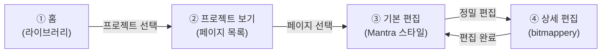

# CLAUDE.md — TOWA UI Engine

이 파일은 AI 세션 간 공유되는 작업 컨텍스트입니다.

## 프로젝트 개요

TOWA (Translator's One-stop Workstation with AI)의 UI 엔진 (프론트엔드).
프로젝트 전체 설명은 [TOWA/README.md](../README.md) 참조.
다른 팀원의 엔진 코드는 `../model_engine/`, `../service_engine/`에서 확인 가능 (통신 규격 등 참조 시).

## 현재 단계

**설계 + 프로토타이핑 단계** (2026-03-18 기준, 3주차)

당면 목표: 전체 UI 와이어프레임 완성 → HTML 프로토타입 → bitmappery 커스터마이징

## 기술 스택

| 항목 | 선택 | 비고 |
|------|------|------|
| 프레임워크 | Vue 3 + TypeScript | bitmappery가 Vue 3 기반 |
| 상태 관리 | Vuex 4 | bitmappery에서 사용 중 |
| 라우팅 | Vue Router | 화면 전환용 |
| 빌드 | Vite | |
| 캔버스 엔진 | zCanvas | bitmappery의 렌더링 엔진 |
| 1차 배포 | 웹앱 (브라우저 접속) | |
| 2차 배포 | Electron (추후) | 데스크톱 앱 래핑 |
| UI 프레임워크 | 미정 | |

## 화면 구성 (4개 화면)



- **① 홈**: 프로젝트 라이브러리, 생성/설정
- **② 프로젝트 보기**: 페이지 썸네일 그리드, 프로젝트 관리
- **③ 기본 편집**: 번역 작업 메인 화면 (텍스트 목록 + 캔버스 + 레이어)
- **④ 상세 편집**: bitmappery 기반 픽셀 편집 (정밀 작업 시 진입)

상세 레이아웃은 [TOWA/README.md](../README.md)의 Mermaid 조감도 참조.

## 프로젝트 구조

```
TOWA/                    # monorepo
├── ui_engine/           # 이 디렉토리 (프론트엔드)
│   ├── bitmappery/      # 원본 클론. 상세 편집 뷰의 캔버스 엔진
│   └── (예정) towa-app/ # 메인 앱. bitmappery를 컴포넌트로 embed
├── model_engine/        # AI 추론 (팀원 담당)
└── service_engine/      # 웹 서비스 (팀원 담당)
```

bitmappery 안에서 확장하는 것이 아니라, 별도 앱(towa-app)을 만들고 bitmappery의 핵심을 가져다 쓰는 구조.

## bitmappery 커스터마이징 방침

- 불필요한 기능은 우선 **비활성화** (코드 삭제가 아닌 off)
- 전체 그림이 확정된 후에 불필요한 기능을 완전히 제거하여 소스 단순화
- bitmappery의 기존 UI 자체가 상세 편집 뷰의 베이스가 됨

## 백엔드 API (참고)

백엔드 API 명세는 팀 Notion에 있음 (326de6fff172800dac83da595208ea46).
프론트엔드가 먼저 UI를 정의하고 placeholder로 개발하면, 백엔드가 맞춰주는 구조.

주요 endpoint:
- `POST /api/v1/ai/detect-text` — 텍스트 검출
- `POST /api/v1/ai/inpaint` — 인페인팅
- `POST /api/v1/ai/translate` — 번역
- `PUT /api/v1/projects/{id}/layers` — 레이어 상태 저장
- `GET /api/v1/projects/{id}/export` — 결과물 export

## 프로젝트 파일 포맷

자체 포맷 사용 (bitmappery의 .bpy가 아닌 별도 포맷). 상세 스펙은 추후 설계.

## 작업 방식

- **애자일**: 핵심 기능부터 개발하고 반복 개선
- **병렬 세션**: 전체 UI 프로토타입(세션 1)과 bitmappery 커스터마이징(세션 2)을 병렬 진행
- **프로토타이핑**: Mermaid 조감도로 전체 흐름 → HTML 프로토타입으로 디테일
- **다이어그램**: 모든 구조/흐름 다이어그램은 Mermaid로 통일 (ASCII 사용 금지)

## Git 규칙

- **브랜치**: 엔진 단위 (`ui_engine`, `model_engine`, `service_engine`)에서 작업. 브랜치는 유지하면서 중간중간 main에 merge.
- **merge/pull**: 어느 정도 작업이 되면 main에 merge. 수시로 main에서 pull 받아서 다른 팀원 변경사항 반영.
- **커밋 메시지**: 간결하게. Co-authored-by 등 AI 관련 태그 절대 넣지 말 것.

## 문서 관리

### 로컬 문서
- **CLAUDE.md**: AI 세션 간 공유 컨텍스트 (이 파일). 최신 상태 유지.
- **TODO.md**: 할 일 관리 (당장 할 일 + Future + 에이전트별 작업 배정)
- **CHANGELOG.md**: 작업 완료 시 반드시 기록 (KST 기준 시간 포함). 빠뜨리지 말 것.
- **../README.md**: 프로젝트 전체 설명 (monorepo 루트)

### Notion 연동

팀 Notion workspace: **2026-1 자주프 HQ**

Notion 작성자 ID: `user://7c0de94a-92a9-46fb-bc13-ba352b583b6a` (JangYeon Kim) — 설계 문서 등 Notion 항목 생성 시 작성자 필드에 사용.

핵심 DB: **설계 문서** (`327de6fff1728046b923fb03bb8c7767`)
- 분류: UI 엔진 / 모델 엔진 / 서비스 엔진 / 전체 시스템
- 설계 작업 완료 시 반드시 여기에 결과 저장
- **항목 추가**: 확인 없이 자유롭게 (빠뜨리지 않도록)
- **항목 수정**: 기존 내용 변경/삭제 시 반드시 사용자 확인

**Progress Dashboard** (`327de6fff172801aa17be741ebe8c9fa`)
- 프로젝트 단위 진행 상황 관리 (칸반/간트)
- 사용자 지시 시 업데이트

참고 문서 (Notion):
- API 명세: `326de6fff172800dac83da595208ea46`
- 백엔드 Overview: `327de6fff172808fb663c4dc29ba4d43`
- DB 스키마: `326de6fff17280b28562da036934c365`

## 장기 고려 사항 (지금 구현 X, 설계 시 참고)

- 협업 기능 → 파일 저장 구조 설계 시 고려
- 커뮤니티 기능 (번역 프로젝트 공유/선점)
- 워크플로우 플러그인 시스템 (ComfyUI 스타일)
- PSD 등 외부 포맷 export
