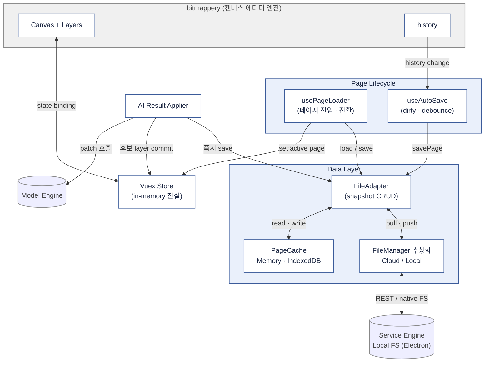

# ui_engine

TOWA (Translator's One-stop Workstation with AI)의 **UI 엔진** (프론트엔드).

## 디렉토리 구조

```
ui_engine/
├── towa-app/            # 메인 앱 (Vue 3). bitmappery를 캔버스 엔진으로 embed
├── bitmappery/          # bitmappery 클론 (상세 편집 뷰의 캔버스 엔진, 커스터마이징됨)
├── docs/                # 설계 문서
│   ├── design-bitmappery-integration.md
│   ├── design-file-system.md
│   └── ui_to_service.md
├── CLAUDE.md            # AI 세션 간 공유 컨텍스트
├── TODO.md              # 할 일 관리
└── CHANGELOG.md         # 작업 내역 (KST 기준)
```

## 기술 스택

- **Vue 3** + **TypeScript** + **Vuex 4** + **Vue Router**
- **Vite** (빌드)
- **zCanvas** (캔버스 렌더링, bitmappery 내부)
- **IndexedDB** (standalone 모드 로컬 저장)
- **Tailwind CSS** (스타일링)

## 로컬 실행

```bash
cd towa-app
npm install
npm run dev
# → http://localhost:5173/
```

## 화면 구성

1. **홈** — 프로젝트 라이브러리
2. **프로젝트 보기** — 페이지 썸네일 그리드, 대시보드
3. **편집** — 번역 작업 (텍스트 목록 + 캔버스 + 레이어, translator 모드)
4. **상세 편집** — 픽셀 편집 (bitmappery 전체 도구, typesetter 모드)

## 컴포넌트 구조

클라이언트 단일 SPA 안에서 도메인 / 어댑터 / 외부 엔진을 어떻게 분리했는지를 한 장으로.
bitmappery는 위에 한 줄로 인정하고, 그 위에 우리가 짠 컴포넌트들이 어떻게 정적으로 연결되어 있는지를 시각화.



**컴포넌트 역할 (시간이 아니라 관계로 읽기)**

| 컴포넌트 | 누구와 무엇으로 묶여 있나 |
|---|---|
| **Vuex Store** | in-memory 진실의 원천. Canvas는 양방향 binding, lifecycle 컴포넌트들은 commit/dispatch로 변경 |
| **AI Result Applier** | Model Engine 호출 + patch 해석 + Store에 후보 레이어 commit + FileAdapter에 즉시 save 요청. 외부 결과를 우리 모델로 흡수하는 단일 경로 |
| **usePageLoader / useAutoSave** | Store와 FileAdapter 사이에서 페이지 진입·전환·자동 저장 lifecycle을 관장. autosave는 bitmappery `history`를 구독해서 dirty 추적 |
| **FileAdapter** | snapshot 단위 CRUD 인터페이스. 상위(lifecycle)와 하위(cache·FileManager)의 결합점 |
| **PageCache** | Memory + IndexedDB 2-tier 캐시. FileAdapter가 우선 조회·기록 |
| **FileManager** | 진실의 영구 원천. Cloud REST 또는 Local FS(Electron)로 교체 가능 |
| **외부 엔진** | Model = AI patch 발급 / Service = 영구 저장 백엔드 |

**이 그림에서 읽히는 설계 의도**

- **수직 분리 (View → Domain → Service → Adapter → Engine)**: 단순 페이지 묶음이 아니라 의도된 레이어링. View는 store만 알고, Service가 adapter resolution을 담당.
- **`bmp/` namespace**: bitmappery는 원래 non-namespaced store. 우리 도메인(`projects`, `pages`)과 충돌 없이 한 store에 공존시키기 위해 namespace로 격리. 140+ 곳의 store 접근을 일괄 수정한 결과물.
- **두 개의 Adapter 축**: `FileAdapter`(저장)와 `BackendAdapter`(API/AI). standalone ↔ cloud 전환이 View/Domain 코드 변경 없이 가능.
- **AI Result Applier**: AI는 destructive하게 결과를 덮어쓰지 않는다. patch 형태로 받아서 항상 새 후보 레이어로 추가 — 사용자가 채택/거부 가능.
