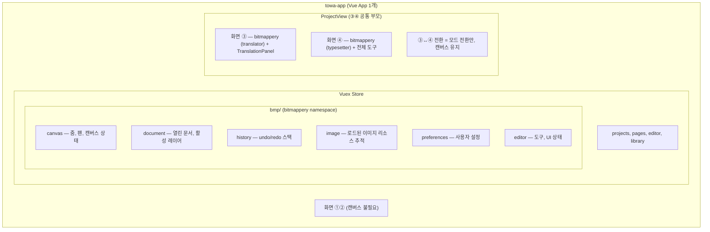

# bitmappery 통합 설계

## 개요

bitmappery(오픈소스 이미지 편집기)를 towa-app에 통합하여 화면 ③(편집)과 ④(상세 편집)의 캔버스 엔진으로 사용한다.

---

## 1. 통합 방식: 단일 Vue App, Vuex namespace 등록

### 결정

bitmappery를 별도 Vue app이 아닌 **towa-app의 컴포넌트로 직접 import**한다.
bitmappery의 Vuex store 모듈 6개를 `bmp` namespace로 towa-app store에 등록한다.

### 대안 비교

| 방식 | 장점 | 단점 |
|------|------|------|
| **별도 Vue app** | bitmappery 코드 수정 거의 없음 | 앱 간 통신 필요, 인스턴스 공유 불가, ③↔④ 전환마다 재생성 |
| **직접 통합 (채택)** | store 직접 접근, 인스턴스 공유, 확장성 | bitmappery store 접근 코드 일괄 수정 필요 (140+ 곳) |

### 채택 근거

- 화면 ③④ 모두 bitmappery 캔버스 사용 — 도구만 다름.
- 하나의 캔버스 인스턴스를 공유해야 화면 전환 시 상태 유지 (이미지, 레이어, undo 히스토리).
- towa-app의 TranslationPanel이 bitmappery 레이어를 직접 참조해야 함 (bridge 없이).

### 구조도



### Store 수정 범위

bitmappery는 non-namespaced store 접근을 사용:

```javascript
// 현재 (namespace 없음)
mapState(["blindActive", "panMode"])
mapGetters(["activeDocument"])
store.commit("addLayer", layer)
store.getters.activeDocument
```

이를 `bmp` namespace로 일괄 수정:

```javascript
// 변경 후
mapState("bmp", ["blindActive", "panMode"])
mapGetters("bmp", ["activeDocument"])
store.commit("bmp/addLayer", layer)
store.getters["bmp/activeDocument"]
```

- 컴포넌트: 45개 파일, `mapState`/`mapGetters`/`mapMutations`/`mapActions` 140+ 곳
- 액션 파일: 25개, `store.commit()`/`store.getters` 직접 접근
- 서비스: KeyboardService 등 store 레퍼런스를 변수에 캐싱하는 곳

패턴이 일정하므로 기계적 치환 가능.

---

## 2. 모드 시스템: translator / typesetter

### 모드 정의

| 모드 | 화면 | 노출 도구 | header-menu | File 메뉴 |
|------|------|----------|-------------|----------|
| **translator** (역자) | ③ 편집 | 텍스트, 이동, 줌, 드래그 | 숨김 | 비활성화 |
| **typesetter** (식자) | ④ 상세 편집 | 전체 이미지 편집 도구 | 표시 | towa-app이 대체 |

### 구현: feature flag 동적화

현재 `towa-features.ts`는 정적 const 객체 → **reactive override 방식으로 확장**.

```typescript
// towa-mode-presets.ts (신규)
export type TowaMode = 'translator' | 'typesetter';

export const MODE_PRESETS: Record<TowaMode, Partial<Record<FeatureKey, boolean>>> = {
  translator: {
    TOOL_TEXT: true,
    TOOL_MOVE: true,
    TOOL_DRAG: true,
    TOOL_ZOOM: true,
    TOOL_SCALE: true,
    // 나머지 도구 false
    TOOL_LASSO: false,
    TOOL_SELECTION: false,
    TOOL_BRUSH: false,
    TOOL_ERASER: false,
    // ...
    UI_HEADER_MENU: false,
    FILE_IMAGE_OPEN: false,
    FILE_IMAGE_EXPORT: false,
    FILE_BPY_SAVE: false,
    FILE_BPY_LOAD: false,
  },
  typesetter: {
    // 대부분 기본값(true) 유지, File 관련만 비활성화
    FILE_IMAGE_OPEN: false,
    FILE_BPY_SAVE: false,
    FILE_BPY_LOAD: false,
  },
};
```

```typescript
// towa-features.ts (수정)
const modeOverrides = ref<Partial<Record<FeatureKey, boolean>>>({});

export function setTowaMode(mode: TowaMode): void {
  modeOverrides.value = MODE_PRESETS[mode] ?? {};
}

export function isFeatureEnabled(key: FeatureKey): boolean {
  return modeOverrides.value[key] ?? TOWA_FEATURES[key];
}
```

`setTowaMode()`를 호출하면 bitmappery UI가 즉시 반응 — 도구함, 메뉴, 패널이 모드에 맞게 변경.

---

## 3. 레이어 관리

### 원칙: bitmappery가 전부 관리

레이어 구조/순서/그룹/가시성은 전적으로 bitmappery 영역.
towa-app은 `store.getters['bmp/activeDocument'].layers`로 **읽기만** 함.

towa-app이 레이어에 관여하는 경우:
1. **TranslationPanel**: `layer.type === 'text'`로 텍스트 레이어만 필터하여 표시 (읽기)
2. **AI 결과 주입**: `store.commit('bmp/addLayer', aiLayer)` (쓰기, 새 후보 레이어 추가)
3. **File Adapter**: 페이지 로드 시 bitmappery document 전체를 생성/교체

### AI 결과 레이어 규칙

AI가 만든 text/image 결과는 특별한 layer type이 아니다.

- text result는 Bitmappery의 일반 `text` layer로 추가한다.
- image artifact result는 Bitmappery의 일반 `graphic` layer로 추가한다.
- 매 AI 실행마다 새 레이어를 최상단에 추가한다.
- 기존 사용자 레이어나 이전 AI 레이어를 자동 수정/교체하지 않는다.
- `replace_source_ref` patch도 UI에서는 기존 layer source 교체로 해석하지 않고, 새 `graphic` 후보 레이어 추가로 처리한다.
- text layer 이름은 `AI <Operation> <YYYYMMDD HHmm> #NN` 형식을 사용한다.
- text style은 `Noto Sans KR`, `24px`, black으로 고정한다.

이 규칙의 목적은 AI 결과를 destructive edit이 아니라 사용자가 확인하고 채택할 수 있는 후보 레이어로 남기는 것이다.

### 레이어 구성 (컨벤션)

만화 페이지 1장의 기본 레이어 구성:

```
layer[0]: original       — 원본 이미지 (LAYER_IMAGE, 잠금 처리)
layer[1]: inpaint        — AI 인페인팅 결과 (LAYER_GRAPHIC)
layer[2~]: text / custom — 텍스트 레이어, 사용자 추가 레이어 (자유 배치)
```

- layer[0] original은 편집 불가로 잠금 (읽기 전용 보호)
- 그 외는 사용자가 자유롭게 추가/삭제/순서 변경
- 텍스트와 커스텀 레이어의 순서 강제 없음 (flat stack, 사용자 재량)

### 레이어 그룹 (향후)

현재 bitmappery는 레이어 그룹을 지원하지 않음.
페이지당 레이어가 많아지면 관리가 어려워지므로 향후 구현 예정:
- bitmappery의 `Layer` 타입에 `children: Layer[]` 추가
- 레이어 패널 UI에 그룹 접기/펼치기
- 별도 작업으로 진행 (bitmappery UI 커스터마이징의 일부)

---

## 4. CSS 격리 + 테마 매핑

### CSS 격리

bitmappery의 전역 CSS가 towa-app과 충돌하는 부분:
- `#app` selector → `#bitmappery-app`으로 변경
- `html, body { height: 100%; overflow: hidden }` → `#bitmappery-app` scope로 축소
- SCSS 파일에서 `#app` 참조 → 일괄 치환

### 테마 연결

bitmappery `_colors.scss`의 하드코딩 색상을 CSS custom property fallback으로 변경:

```scss
// 기존
$color-1: #0db0bc;
$color-bg-dark: #282828;

// 변경
$color-1: var(--bmp-accent, #0db0bc);
$color-bg-dark: var(--bmp-bg-dark, #282828);
```

towa-app에서 변수 매핑:

```css
#bitmappery-app {
  --bmp-accent: var(--towa-accent);       /* #9569B4 */
  --bmp-bg-dark: var(--towa-bg);          /* #0f0d18 */
  --bmp-bg-light: var(--towa-surface);    /* #1a1726 */
  --bmp-text: var(--towa-text);           /* #e6e6e6 */
}
```

towa-app의 dark/light 테마 전환 시 bitmappery도 자동 연동.

---

## 5. 플러그인/의존성 처리

### i18n
- bitmappery: `vue-i18n` 사용 (33개 컴포넌트에 component-local messages, `$t()` 125회)
- towa-app: 현재 i18n 미사용
- 전략: bitmappery의 i18n 인스턴스를 towa-app에 등록. 향후 towa-app에 i18n 추가 시 message merge.

### FloatingVue (tooltip)
- bitmappery 컴포넌트가 `v-tooltip` directive 사용
- towa-app entry point에서 `app.directive('tooltip', vTooltip)` 등록

### Buffer polyfill
- psd.js가 `globalThis.Buffer` 필요
- towa-app entry point에서 한 번 설정

### Vite 설정
- `@bitmappery` alias 추가 (`../bitmappery/src`)
- bitmappery SCSS 변수 resolve 경로 설정

---

## 6. 컴포넌트 책임 분담

| 컴포넌트 | 위치 | 이유 |
|---------|------|------|
| 캔버스, 도구함, 레이어 패널 | bitmappery | 이미지 편집 도메인 |
| header-menu (수정된) | bitmappery | 편집 도구 메뉴 (File 메뉴는 비활성화) |
| TranslationPanel | towa-app | 번역 도메인 (원문/번역문, AI 호출, 상태 관리) |
| PageSidePanel | towa-app | 프로젝트/페이지 관리 |

TranslationPanel은 bitmappery store를 읽지만, **번역 워크플로우**는 towa-app의 도메인이므로 towa-app에 둔다.

---

## 7. 위험 요소 & 대응

| 위험 | 영향 | 대응 |
|------|------|------|
| 키보드 이벤트 충돌 | bitmappery KeyboardService가 window 리스닝 → towa-app 단축키와 겹침 | bitmappery 영역 focus 시만 활성화, blur 시 suspend |
| z-index 충돌 | bitmappery 모달(z-index: 400)이 towa-app 위에 뜸 | container에 `isolation: isolate` (stacking context 분리) |
| namespace 수정 누락 | 런타임 에러 (undefined getter/mutation) | 수정 후 grep으로 non-namespaced 접근 전수 검출 + 빌드 테스트 |
| i18n key 충돌 | 번역 문자열 꼬임 | bitmappery는 component-local messages 사용하므로 충돌 가능성 낮음. 확인 필요. |

---

## 8. 미확정 사항 (병합 시 결정)

- TranslationPanel ↔ bitmappery 텍스트 레이어 연동 디테일
- 레이어 그룹 구현 시점 및 방식
- bitmappery UI 전체 리디자인 범위 (어디까지 갈아엎을지)

---

## 구현 순서

1. **Store namespace화** — bitmappery store 모듈을 `bmp` namespace로, 접근 코드 일괄 수정
2. **Feature flag 동적화** — 모드 프리셋 + `setTowaMode()` 구현
3. **CSS 격리 + 테마 변수화** — selector 변경, 색상 CSS custom property 전환
4. **towa-app에 import** — Vite 설정, store 등록, 플러그인 등록, DetailEditorTab에 삽입
5. **동작 검증** — 렌더링, 도구, 레이어, 모달, 테마 전환
6. **화면 ③ 적용** — EditorTab에 translator 모드 캔버스 삽입 (후순위)
