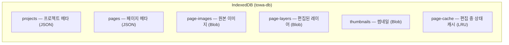
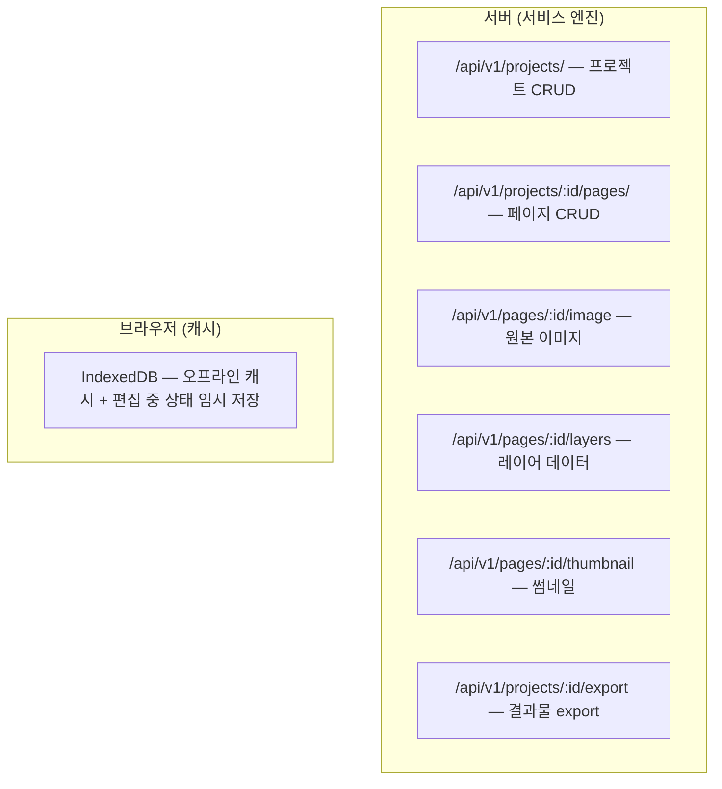
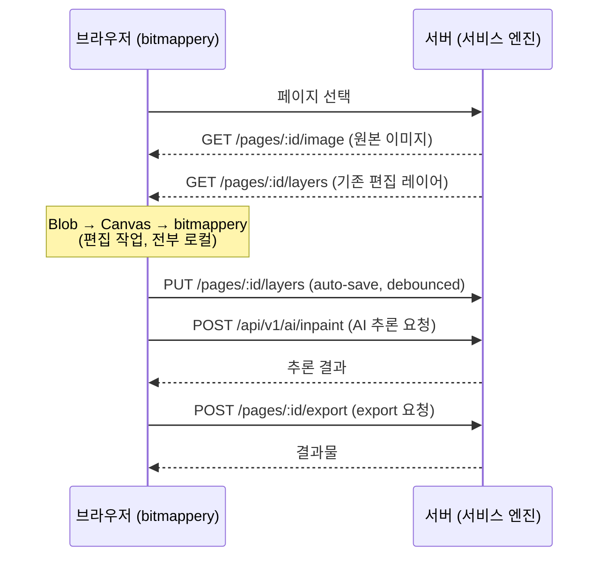
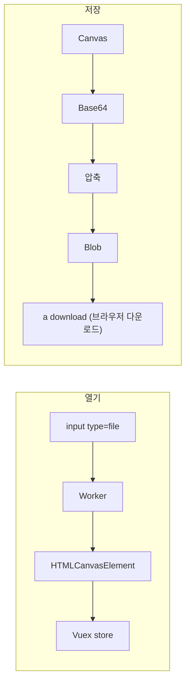

# TOWA 파일 시스템 설계

## 개요

TOWA에서 프로젝트/페이지 데이터가 저장되고 로드되는 전체 흐름을 정의한다.
standalone(로컬)과 cloud(서버) 두 가지 deployment mode를 지원하며, 편집 엔진(bitmappery)은 양쪽 모두 클라이언트에서 동일하게 동작한다.

---

## 1. 데이터 모델

### 프로젝트

```typescript
interface Project {
  id: string
  name: string
  sourceLang: string        // 'ja', 'en', ...
  targetLang: string        // 'ko', ...
  pageCount: number
  status: 'todo' | 'in-progress' | 'done'
  folder: string            // '주간연재/점프'
  config: ProjectConfig     // 초벌번역 설정 등
  createdAt: string
  updatedAt: string
}
```

### 페이지

```typescript
interface Page {
  id: string
  projectId: string
  index: number             // 페이지 순서
  status: 'waiting' | 'ai-processing' | 'in-progress' | 'done'
  thumbnail: string         // 썸네일 URL 또는 data URI
  textBlocks: TextBlock[]   // 검출된 텍스트 블록 (번역 도메인 데이터)
}
```

레이어 데이터는 towa-app이 별도 관리하지 않음. bitmappery의 Vuex store (`bmp/document`)에서 직접 접근.

### 텍스트 블록

번역 워크플로우에서 사용하는 텍스트 메타데이터. bitmappery의 텍스트 레이어와는 별개의 도메인.

```typescript
interface TextBlock {
  id: string
  pageId: string
  bbox: { x: number; y: number; w: number; h: number }
  original: string          // 원문 (AI 검출 결과)
  translated: string        // 번역문
  font: string
  fontSize: number
  color: string
  status: 'detected' | 'translated' | 'edited'
}
```

### 레이어 (bitmappery 관할)

레이어 구조/관리는 전적으로 bitmappery의 영역. towa-app은 `store.getters['bmp/activeDocument'].layers`로 읽기만 함.

bitmappery 레이어 타입 참조 (`bitmappery/src/definitions/document.ts`):

```typescript
// bitmappery의 Layer 타입 (참고용, 수정 불가)
type Layer = {
  id: string
  name: string
  type: LayerTypes           // 'graphic' | 'image' | 'text'
  source?: HTMLCanvasElement  // 이미지 데이터 (Canvas)
  mask?: HTMLCanvasElement    // 마스크
  left: number; top: number
  width: number; height: number
  visible: boolean
  transparent: boolean
  transform: Transform        // scale, rotation, mirror
  filters: Filters            // opacity, blendMode, 색상 조정
  text: Text                  // font, size, color, value (텍스트 레이어용)
}

// bitmappery의 Document 타입
type Document = {
  id: string
  name: string
  layers: Layer[]
  width: number; height: number
  selections: Record<string, Selection>
}
```

towa-app이 bitmappery 레이어에 대해 아는 것:
- `store.getters['bmp/activeDocument'].layers`로 전체 레이어 접근
- `layer.type === 'text'`로 텍스트 레이어 필터 (TranslationPanel 연동)
- AI 인페인팅 결과를 `store.commit('bmp/addLayer', ...)` 로 주입
- 그 외 레이어 순서, 그룹, 가시성 등은 bitmappery UI가 관리

---

## 2. 저장 전략: DB 기반 (파일 기반 아님)

### 왜 파일(.towa) 기반이 아닌가

파일 기반(Photoshop .psd, bitmappery .bpy)은 사용자가 직접 파일 경로를 관리하는 구조.
TOWA에는 부적합:

| | 파일 기반 (.towa) | DB 기반 (IndexedDB / 서버 DB) |
|---|---|---|
| 프로젝트 열기 | File > Open > 경로 선택 | 앱 라이브러리에서 클릭 |
| 저장 | File > Save As | 자동 저장 |
| 프로젝트 크기 | 수십 페이지 = 수백MB 단일 파일 | 페이지 단위 저장, 필요한 것만 로드 |
| 페이지 단위 접근 | 전체 파일 파싱 후 추출 | 해당 페이지만 바로 조회 |
| cloud 연동 | 파일 업/다운로드 필요 | 서버 DB와 동일한 구조 |

TOWA는 Figma/Notion처럼 **앱이 저장소를 관리**하는 모델.
사용자는 "파일"이 아니라 "프로젝트"를 다룬다.

### .towa 파일의 역할: 내보내기/공유 전용

```
일상적 작업흐름:
  IndexedDB (standalone) 또는 서버 DB (cloud)에 자동 저장
  사용자는 파일 경로를 의식하지 않음

내보내기 (Export):
  .towa  → 프로젝트 아카이브 (다른 PC 이동, 백업, 공유)
  .png   → 완성된 페이지 이미지
  .psd   → Photoshop 호환 (외부 작업자 전달)
  .zip   → 전체 페이지 일괄 export
```

앱 종속성 우려는 export 기능으로 해소. 언제든 표준 포맷으로 꺼낼 수 있음.

### standalone 모드: IndexedDB

브라우저 로컬 저장소. 서버 불필요.



- 프로젝트 생성: 이미지 드래그앤드롭 → IndexedDB에 저장
- 편집: IndexedDB → Canvas → bitmappery → Canvas → IndexedDB (자동 저장)
- export: Canvas → Blob → 브라우저 다운로드

### cloud 모드: 서버 DB + IndexedDB 캐시

서비스 엔진(백엔드) API를 통해 서버에 저장.



- 프로젝트 생성: 이미지 업로드 → 서버 저장
- 편집: 서버에서 이미지 fetch → Canvas → bitmappery → Canvas → 서버로 PUT
- 자동 저장: debounced PUT (편집 중 일정 간격)
- 오프라인: IndexedDB에 캐시, 온라인 복귀 시 sync

---

## 3. File Adapter 계층

편집 엔진(bitmappery)과 저장소 사이의 추상화 계층.
deployment mode에 따라 구현체만 교체.

### 인터페이스 (snapshot 중심)

7주차에 cloud 모드 연동을 진행하면서, 단순 load/save 시그니처에서 **snapshot 단위 CRUD**로 인터페이스를 재정의했다. 페이지 하나는 메타데이터 + 원본 이미지 + 레이어 blob + 썸네일을 한 단위(snapshot)로 묶어서 원자적으로 처리한다.

```typescript
interface FileAdapter {
  // 프로젝트 CRUD
  listProjects(): Promise<ProjectRecord[]>
  getProject(id: string): Promise<ProjectRecord | null>
  createProject(record: ProjectRecord): Promise<void>
  updateProject(record: ProjectRecord): Promise<void>
  deleteProject(id: string): Promise<void>

  // 페이지 CRUD (snapshot 단위)
  listPageSummaries(projectId: string): Promise<PageSummary[]>
  getPageSnapshot(pageId: string): Promise<PageSnapshot | null>
  createPage(projectId: string, snapshot: PageSnapshot): Promise<PageSummary>
  savePageSnapshot(pageId: string, snapshot: PageSnapshot): Promise<PageSummary>
  deletePage(pageId: string): Promise<void>

  // 썸네일 (별도 fetch가 가능하도록 분리)
  getThumbnailBlob(pageId: string): Promise<Blob | null>
}

interface PageSnapshot {
  page: PageMeta            // id, projectId, index, status, textBlocks
  originalImage: Blob       // 원본 만화 이미지
  layerBlob: Blob           // bitmappery DocumentFactory.toBlob() 결과
  thumbnail: Blob           // Canvas 축소본
}
```

이 구조의 장점:
- 페이지 저장이 원자적 (메타데이터·이미지·레이어·썸네일이 동시에 일관된 상태로 저장)
- cloud 모드에서 multipart 요청 한 번으로 처리 가능
- delete 시 dense reindex로 페이지 순서 자동 재정렬

### 구현체

```typescript
class LocalFileAdapter implements FileAdapter {
  // IndexedDB 6개 object store에 분산 저장
  // (projects, pages, page-images, page-layers, thumbnails, page-cache)
}

class CloudFileAdapter implements FileAdapter {
  // backend.files.* 메서드에 위임
  // FilesBackend SDK가 multipart HTTP 요청을 처리
}
```

### deployment mode 분기

```typescript
// file-adapter/index.ts
export function createFileAdapter(): FileAdapter {
  return getDeploymentMode() === 'cloud'
    ? new CloudFileAdapter()
    : new LocalFileAdapter()
}
```

main.ts에서 모드별 부트스트랩:
- standalone: seed 데이터 삽입 후 IndexedDB 사용
- cloud: localStorage에 저장된 세션 복원 → 서버에서 프로젝트 목록 fetch

---

## 4. 메모리 관리: 단일 페이지 로드 원칙

### 문제

bitmappery는 레이어를 HTMLCanvasElement로 보관. 고해상도 만화 페이지 기준:

```
1 레이어 (2000×2800px) = width × height × 4 bytes ≈ 22MB
1 페이지 × 4 레이어 ≈ 88MB
10 페이지 동시 로드 ≈ 880MB → 브라우저 메모리 한계
```

### 원칙

**bitmappery에는 현재 편집 중인 페이지 1개만 로드한다.**
나머지 페이지는 towa-app의 PageSidePanel에 썸네일로만 표시.

### 페이지 전환 흐름

```mermaid
sequenceDiagram
    actor User
    participant TOWA as towa-app
    participant BMP as bitmappery
    participant Cache as 캐시 (메모리/IndexedDB)
    participant Store as 저장소

    Note over User,Store: 페이지 A 편집 중 → 페이지 B 클릭

    User->>TOWA: 페이지 B 선택

    rect rgb(60, 50, 80)
        Note over TOWA,Store: 1. 페이지 A 직렬화 + 저장
        TOWA->>BMP: DocumentFactory.toBlob()
        BMP-->>TOWA: Blob
        TOWA->>Cache: 캐시 저장
        opt 변경사항 있으면
            TOWA->>Store: auto-save (persist)
        end
    end

    rect rgb(50, 60, 80)
        Note over TOWA,BMP: 2. 페이지 A 해제
        TOWA->>BMP: document 해제 (Canvas 메모리 반환)
    end

    rect rgb(50, 80, 60)
        Note over TOWA,Store: 3. 페이지 B 로드
        alt 캐시에 있으면
            Cache-->>TOWA: 캐시된 Blob
            TOWA->>BMP: DocumentFactory.fromBlob()
        else 캐시에 없으면
            Store-->>TOWA: 이미지 fetch
            TOWA->>BMP: document 생성
        end
    end

    Note over User,Store: 복귀 시: A로 돌아오면 캐시에서 복원 (undo 히스토리 포함)
```



### 캐시 직렬화 포맷

bitmappery의 `DocumentFactory.serialize()` / `DocumentFactory.toBlob()` 를 그대로 사용.
- 이미 구현/검증 완료된 직렬화 (Canvas → Base64 → 압축 → Blob)
- 모든 레이어, 필터, 변환 정보를 완벽하게 복원
- 캐시는 앱 내부 용도이므로 포맷 호환성 고려 불필요
- .towa export 포맷은 나중에 별도 설계 (캐시 포맷과 무관)

### 캐시 전략

```mermaid
graph TD
    L1["메모리 캐시 (Blob URL)<br>최근 2~3페이지 · 즉시 복원 · 탭 종료 시 소멸"]
    L2["IndexedDB 캐시<br>LRU 방식 N페이지 · ~100ms 복원 · 탭 종료 후에도 유지"]
    L3["영구 저장소 (IndexedDB 또는 서버)<br>명시적/자동 저장 · 완전한 상태 복원"]

    L1 -->|miss| L2
    L2 -->|miss| L3

    style L1 fill:#2a4040,stroke:#4a8080
    style L2 fill:#2a3050,stroke:#4a6090
    style L3 fill:#3a2a50,stroke:#6a4a90
```



---

## 5. 자동 저장

### 트리거: bitmappery history 모듈

bitmappery는 모든 의미 있는 편집(브러시, 레이어 추가, 텍스트 수정 등)을 undo 히스토리에 `enqueueState()`로 기록한다. 줌, 팬 같은 무의미한 변경은 기록하지 않음.

이 히스토리 변화를 자동 저장 트리거로 사용:

```typescript
// history state 변화 감지 → debounce → 저장
watch(
  () => store.state.bmp.history,
  debounce(() => {
    fileAdapter.savePage(currentPageId)
  }, 30_000)  // 마지막 편집 후 30초 뒤 저장
)
```

### 동작 방식
- 편집 발생 → dirty flag 설정
- 30초간 추가 편집 없으면 → 저장 실행
- 저장 중 추가 편집 → 저장 완료 후 재저장
- 페이지 전환 시 → 즉시 저장 (debounce 무시)

---

## 6. 클라우드 편집 아키텍처

### 결정: 클라이언트 편집 + 서버 저장

편집은 클라이언트(브라우저)에서 수행. 서버는 저장/조회/AI 추론만 담당.

### SSR 방식을 채택하지 않는 이유

SSR(서버 사이드 렌더링) = 서버에서 Canvas를 돌리고 결과를 클라이언트로 스트리밍:
- 별도 렌더링 엔진 필요 (node-canvas 또는 headless Chrome)
- 브러시 스트로크마다 네트워크 왕복 → 레이턴시 문제
- 서버 비용 증가 (GPU/CPU 렌더링)
- 협업 편집이 필요할 때 비로소 가치가 생기는 구조

현재 시나리오("한 사람이 한 페이지 편집")에서는 과도한 복잡성.

### 편집 흐름



### 오프라인 지원 (향후)

- 편집 중 네트워크 끊김 → IndexedDB에 계속 캐시
- 온라인 복귀 시 IndexedDB → 서버 sync
- 충돌 해결: last-write-wins (단일 사용자 시나리오)

---

## 7. bitmappery와의 연결점

### bitmappery의 현재 파일 처리



- 문서/레이어는 HTMLCanvasElement로 메모리 보관
- .bpy 자체 포맷: JSON + Base64 이미지 → 압축 → Blob
- 클라우드 저장: Dropbox/GDrive/S3 커넥터 (feature flag로 비활성화 완료)

### TOWA에서 비활성화하는 bitmappery feature flag

| Feature Flag | 이유 |
|-------------|------|
| `FILE_IMAGE_OPEN` | towa-app이 페이지 이미지 로드 관리 |
| `FILE_IMAGE_EXPORT` | towa-app이 export 관리 |
| `FILE_BPY_SAVE` | .bpy 포맷 불필요 (towa 자체 저장 사용) |
| `FILE_BPY_LOAD` | .bpy 포맷 불필요 |
| `FILE_PSD_IMPORT` | 필요시 towa-app 측에서 처리 |
| `FILE_PDF_IMPORT` | 필요시 towa-app 측에서 처리 |
| `CLOUD_DROPBOX` | towa 자체 cloud 사용 (이미 비활성화) |
| `CLOUD_GOOGLE_DRIVE` | 위와 동일 (이미 비활성화) |
| `CLOUD_S3` | 위와 동일 (이미 비활성화) |

### towa-app → bitmappery 이미지 로드 방식

bitmappery의 File 선택 UI를 거치지 않고, 프로그래밍적으로 문서를 생성:

```typescript
// File Adapter 내부에서 호출
import DocumentFactory from '@bitmappery/factories/document-factory'
import LayerFactory from '@bitmappery/factories/layer-factory'
import { imageToCanvas } from '@bitmappery/utils/canvas-util'

async function loadPageIntoBitmappery(imageBlob: Blob, store: Store) {
  const image = await createImageFromBlob(imageBlob)
  const canvas = imageToCanvas(image, image.width, image.height)

  const doc = DocumentFactory.create({
    name: `page-${pageId}`,
    width: image.width,
    height: image.height,
    layers: [
      LayerFactory.create({
        name: 'original',
        source: canvas,
        width: image.width,
        height: image.height,
      })
    ]
  })

  store.commit('bmp/addNewDocument', doc)
}
```

### bitmappery → towa-app 편집 결과 추출

```typescript
async function extractEditResult(store: Store): Promise<Blob> {
  const doc = store.getters['bmp/activeDocument']
  // 각 레이어의 Canvas를 Blob으로 변환
  // 또는 병합된 스냅샷 생성
  return await canvasToBlob(mergedCanvas)
}
```

---

## 8. ID 체계: ULID

7주차에 도입. 프로젝트와 페이지 ID는 모두 [ULID](https://github.com/ulid/spec) (Crockford Base32, 26자)를 사용한다.

```typescript
// utils/ulid.ts
export function createUlid(now = Date.now()): string
export function isCanonicalUlid(value: string): boolean
```

ULID를 택한 이유:
- 시간순 정렬이 가능 (앞 48bit가 timestamp)
- UUID보다 짧고 가독성 있음
- 클라이언트에서 충돌 없이 생성 가능 → cloud 동기화 시 ID 충돌 걱정 없음

이전에는 `proj-${Date.now()}` 같은 간단한 형식을 썼는데, cloud 동기화/multi-device 환경을 고려하면 표준 형식이 안전하다.

## 9. 미확정 사항 (향후 결정)

- TranslationPanel ↔ bitmappery 텍스트 레이어 연동 디테일 (양방향 동기화 구현 시)
- .towa export 포맷 상세 스펙
- 오프라인 sync 구현 (현재는 standalone/cloud 모드 명시적 분기, 자동 sync 없음)

---

## 10. 향후 확장 고려사항

### 자체 프로젝트 파일 포맷 (.towa)
- 프로젝트 메타 + 페이지별 레이어 + 텍스트 블록을 하나로 패키징
- 상세 스펙은 실제 데이터 흐름이 확정된 후 설계

### 협업 기능
- 현재: 단일 사용자 시나리오
- 향후: 페이지 단위 잠금 (한 사람이 편집 중이면 다른 사람은 읽기 전용)
- 더 나아가면: CRDT 기반 실시간 동기화 + SSR 전환 검토

### PSD export
- bitmappery가 PSD import은 지원하지만 export는 미지원
- 외부 라이브러리(ag-psd 등)로 레이어별 Canvas → PSD 변환 필요
- File Adapter의 `exportProject(format: 'psd')` 에서 처리
